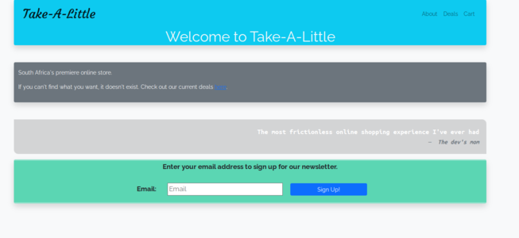
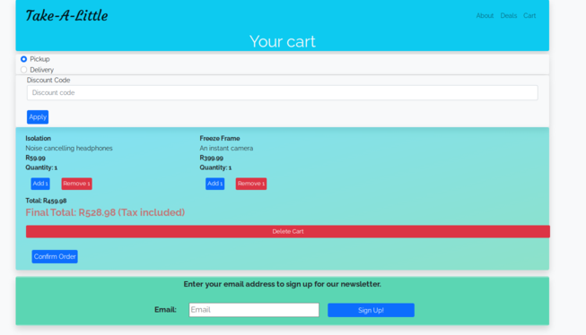

# hyperion-online-store

<!-- Table of contents with description, installation instructions, languages, Technologies and features -->

## Table of contents

1. [Description](#description)
2. [Installation](#installation)
3. [Languages](#languages)
4. [Technologies](#technologies)
5. [Features](#features)
6. [Usage](#usage)
7. [Credits](#credits)

## Description

An online store created for [hyperiondev](https://www.hyperiondev.com/) bootcamp.
It loads products via JS and displays them in a grid. Elements are styled with bootstrap. Additionally, it has a shopping cart. It also has some interactivity added with jQuery.

## Installation

Installation instuctions for Debian based systems:

<!-- Installation instructions for running a local webserver pointed at project root -->
<!-- clone the repository into var/www -->

```
git clone https://github.com/neil-feris/hyperion-online-store.git /var/www/hyperion-online-store
```

<!-- install nginx  -->

```
sudo apt-get install nginx
```

<!-- create a new nginx config file -->

```
sudo nano /etc/nginx/sites-available/hyperion-online-store
```

<!-- add the following to the config file -->

```
server {
    listen 80;
    server_name hyperion-online-store.local;
    root /var/www/html/hyperion-online-store;
    index index.html index.htm;
    location / {
        try_files $uri $uri/ =404;
    }
}
```

<!-- enable the new config file -->

```
sudo ln -s /etc/nginx/sites-available/hyperion-online-store /etc/nginx/sites-enabled/hyperion-online-store
```

<!-- restart nginx -->

```
sudo service nginx restart
```

<!-- run the project -->

```
cd /var/www/html/hyperion-online-store
npm start
```

<!-- list of languages used -->

## Languages

1. [HTML](https://en.wikipedia.org/wiki/HTML)
2. [CSS](https://en.wikipedia.org/wiki/CSS)
3. [JavaScript](https://en.wikipedia.org/wiki/JavaScript)

<!-- list of frameworks and toolkits used -->

## Technologies

1. [Bootstrap](https://getbootstrap.com/)
2. [jQuery](https://jquery.com/)

<!-- list of features -->

## Features

1. [Products](#products)
2. [Cart](#cart)
3. [Checkout](#checkout)

### Products

Products are loaded with JavaScript and are displayed in a responsive bootstrap grid.

### Cart

The cart is loaded with JavaScript and is stored in local storage.

### Checkout

User can choose shipping options as well as apply a coupon code.

## Usage

After installing the project, you can access it by opening a browser and typing in the following URL:

```
http://localhost
```

<!-- insert images from readme-images folder -->

Main Page:



Deals Page:


Cart Page:



## Credits

All code written by [neil-feris](https://www.github.com/neil-feris) and [hyperiondev](https://www.hyperiondev.com/).
